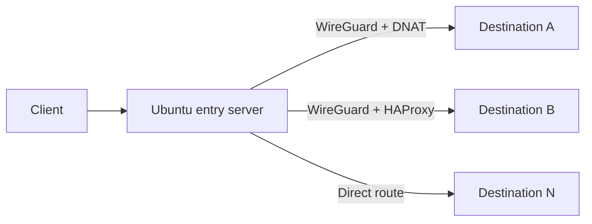

<div align="right">

**Language:** English · [فارسی](README_FA.md)

</div>

<div align="center">

# TunnelMod

### Secure, multi-server tunnel management for Ubuntu

Manage WireGuard, DNAT, and HAProxy routes from a clean self-hosted web panel.

[](CHANGELOG.md)
[](https://github.com/hazhan4268/tunnelmod/actions/workflows/ci.yml)
[](#requirements)
[](LICENSE)

[Installation](#quick-install) · [Features](#features) · [Documentation](#documentation) · [Security](SECURITY.md)

</div>

> [!WARNING]
> TunnelMod is currently beta software and has not received an independent security audit. Test it on a disposable VPS before using it in a sensitive environment.

## Overview

TunnelMod turns an Ubuntu server into a centrally managed entry point for forwarding TCP and UDP traffic to multiple destination servers. It provisions the selected transport, applies persistent network rules, and exposes day-to-day operations through a Persian-friendly responsive interface.



## Features

- Add and manage multiple destination servers without a fixed UI limit
- WireGuard-encrypted forwarding with DNAT
- WireGuard-encrypted TCP proxying with HAProxy health checks
- Low-overhead direct DNAT for TCP and UDP
- Direct HAProxy mode for TCP services
- One-time password enrollment followed by SSH key authentication
- No storage of destination SSH passwords
- Persistent iptables rules and systemd-managed services
- HTTPS administration panel on port `8443`
- Protection against accidentally reusing the panel or active SSH port
- Responsive right-to-left web interface

## Tunnel modes

| Mode | Inter-server encryption | Protocols | Recommended use |
|---|---:|---|---|
| **WireGuard + DNAT** | Yes | TCP / UDP | Default choice for private, low-overhead forwarding |
| **WireGuard + HAProxy** | Yes | TCP | Encrypted TCP proxy with backend health checks |
| **Direct DNAT** | No | TCP / UDP | Lowest overhead on an already trusted network |
| **Direct HAProxy** | No | TCP | TCP proxying when transport encryption is unnecessary |

## Requirements

### Entry server

- Ubuntu `20.04`, `22.04`, or `24.04`
- A user with full `sudo` access; direct root login is not required
- Public IPv4 address
- Port `8443/TCP` allowed by host and provider firewalls

### Destination servers

- Reachable IPv4 address and SSH service
- Root SSH credentials for automatic enrollment and WireGuard provisioning
- Target service listening on `0.0.0.0` or the WireGuard address when using a WireGuard mode

## Quick install

Connect to the entry server with a sudo-enabled account, then run:

```bash
sudo apt update && sudo apt install -y git
git clone https://github.com/hazhan4268/tunnelmod.git
cd tunnelmod
chmod +x install.sh uninstall.sh scripts/tunnel-panel-helper
sudo ./install.sh
```

The installer asks for:

1. The entry server's public IPv4 address.
2. A panel administrator password of at least 10 characters.

Open the panel after installation:

```text
https://YOUR_SERVER_IP:8443
```

> [!NOTE]
> The first installation uses a self-signed TLS certificate. Compare the SHA-256 fingerprint printed by the installer before accepting the browser warning.

## First tunnel

1. Open **Servers** and add a destination IPv4 address, SSH port, root username, and temporary password.
2. Run the connection test and confirm that the server is shown as `online`.
3. Open **Tunnels** and choose a destination, transport mode, protocol, and ports.
4. Prefer **WireGuard + DNAT** unless you specifically need a different mode.
5. Verify the route from a separate client before moving production traffic.

Example HTTPS mapping:

| Setting | Value |
|---|---|
| Mode | WireGuard + DNAT |
| Protocol | TCP, or TCP + UDP when QUIC is required |
| Entry port | `443` |
| Destination port | `443` |

## Operations

Check the web application and network state:

```bash
sudo bash diagnose.sh
```

The diagnostic output automatically redacts IPv4 and IPv6 addresses and can be shared when requesting support. Individual commands are also available:

```bash
sudo systemctl status tunnel-panel --no-pager
sudo journalctl -u tunnel-panel -n 100 --no-pager
sudo wg show
sudo iptables -t nat -L -n -v
sudo iptables -L FORWARD -n -v
```

Back up configuration and state:

```bash
sudo cp -a /var/lib/tunnel-panel /root/tunnel-panel-backup
sudo cp -a /etc/tunnel-panel /root/tunnel-panel-config-backup
```

The second directory contains sensitive material and must be stored securely.

## Updating

Fresh installations include a transactional updater:

```bash
sudo tunnelmod-update
```

It accepts only a fast-forward update from the configured Git origin, creates a private backup, preserves configuration, database, certificates and SSH keys, then performs an HTTPS health check. A failed update automatically restores the previous installed version.

For installations created before this command was introduced, run it once from the cloned repository:

```bash
cd tunnelmod
git pull --ff-only
sudo bash update.sh
```

## Uninstalling

```bash
sudo ./uninstall.sh
```

The uninstaller deliberately leaves active iptables rules and `/var/lib/tunnel-panel` data in place to avoid an unexpected traffic outage. Review and remove them manually when appropriate.

## Documentation

- [راهنمای کامل فارسی](README_FA.md)
- [Persian HTML installation guide](docs/install-fa.html)
- [Security policy](SECURITY.md)
- [Contribution guide](CONTRIBUTING.md)
- [Changelog](CHANGELOG.md)

## Security

Use TunnelMod only on systems and networks you are authorized to administer. Never commit panel databases, private keys, passwords, `/etc/tunnel-panel`, `/var/lib/tunnel-panel`, or real server backups.

Public and destination addresses entered during installation are stored only on the installed server. The repository does not contain or upload them.

Report vulnerabilities privately using GitHub's **Security → Report a vulnerability** feature. See [SECURITY.md](SECURITY.md) for details.

## Contributing

Issues and pull requests are welcome. Run the documented checks and explain the operational and security impact of each change. See [CONTRIBUTING.md](CONTRIBUTING.md).

## License

TunnelMod is released under the [MIT License](LICENSE).

<div align="center">

Made for simple, auditable, self-hosted network operations.

</div>
