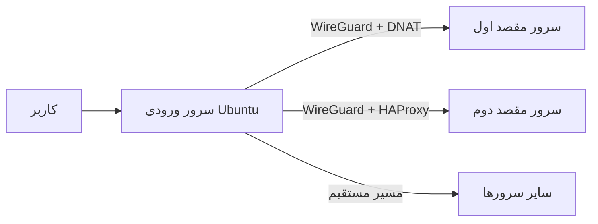

<div align="left">

**زبان:** [English](README.md) · فارسی

</div>

<div align="center">

# TunnelMod

### مدیریت امن و چندسروره تونل در Ubuntu

مدیریت WireGuard، ‏DNAT و HAProxy از طریق یک پنل تحت وب ساده و مستقل

[](CHANGELOG.md)
[](https://github.com/hazhan4268/tunnelmod/actions/workflows/ci.yml)
[](#پیشنیازها)
[](LICENSE)

[نصب سریع](#نصب-سریع) · [قابلیت‌ها](#قابلیتها) · [مستندات](#مستندات) · [امنیت](SECURITY.md)

</div>

> [!WARNING]
> TunnelMod در حال حاضر نسخه آزمایشی است و هنوز ممیزی امنیتی مستقل نشده است. پیش از استفاده در محیط حساس، آن را روی یک VPS آزمایشی بررسی کنید.

## معرفی

TunnelMod یک سرور Ubuntu را به نقطه ورودی مرکزی برای انتقال ترافیک TCP و UDP به چندین سرور مقصد تبدیل می‌کند. پنل، روش ارتباطی انتخاب‌شده را راه‌اندازی می‌کند، قوانین شبکه را به‌صورت پایدار اعمال می‌کند و مدیریت روزمره را از طریق یک رابط فارسی و واکنش‌گرا در اختیار مدیر قرار می‌دهد.



## قابلیت‌ها

- افزودن و مدیریت چندین سرور مقصد بدون محدودیت ثابت در رابط کاربری
- انتقال رمزنگاری‌شده با WireGuard و DNAT
- پروکسی TCP رمزنگاری‌شده با WireGuard و بررسی سلامت HAProxy
- DNAT مستقیم و کم‌سربار برای TCP و UDP
- HAProxy مستقیم برای سرویس‌های TCP
- استفاده یک‌باره از رمز SSH و جایگزینی آن با احراز هویت کلیدی
- عدم ذخیره رمز SSH سرورهای مقصد
- ذخیره پایدار قوانین iptables و مدیریت سرویس‌ها با systemd
- پنل مدیریتی HTTPS روی پورت `8443`
- جلوگیری از استفاده تصادفی پورت پنل یا پورت فعال SSH برای تونل
- رابط فارسی، راست‌به‌چپ و سازگار با موبایل

## روش‌های تونل

| روش | رمزنگاری بین سرورها | پروتکل | کاربرد پیشنهادی |
|---|---:|---|---|
| **WireGuard + DNAT** | دارد | TCP / UDP | انتخاب پیش‌فرض برای انتقال خصوصی و کم‌سربار |
| **WireGuard + HAProxy** | دارد | TCP | پروکسی TCP رمزنگاری‌شده همراه با Health Check |
| **DNAT مستقیم** | ندارد | TCP / UDP | کمترین سربار در شبکه‌ای که از قبل قابل‌اعتماد است |
| **HAProxy مستقیم** | ندارد | TCP | پروکسی TCP بدون نیاز به رمزنگاری مسیر |

## پیش‌نیازها

### سرور ورودی

- Ubuntu نسخه `20.04`،‏ `22.04` یا `24.04`
- کاربر دارای دسترسی کامل `sudo`؛ ورود مستقیم root لازم نیست
- IPv4 عمومی
- باز بودن پورت `8443/TCP` در فایروال سرور و ارائه‌دهنده

### سرورهای مقصد

- IPv4 قابل‌دسترسی و سرویس SSH فعال
- دسترسی root برای ثبت خودکار سرور و راه‌اندازی WireGuard
- گوش‌دادن سرویس مقصد روی `0.0.0.0` یا IP خصوصی WireGuard هنگام استفاده از روش‌های WireGuard

## نصب سریع

با یک کاربر دارای sudo وارد سرور ورودی شوید و اجرا کنید:

```bash
sudo apt update && sudo apt install -y git
git clone https://github.com/hazhan4268/tunnelmod.git
cd tunnelmod
chmod +x install.sh uninstall.sh scripts/tunnel-panel-helper
sudo ./install.sh
```

نصب‌کننده دو مقدار درخواست می‌کند:

1. IPv4 عمومی سرور ورودی.
2. رمز مدیر پنل با حداقل ۱۰ کاراکتر.

پس از پایان نصب، پنل را باز کنید:

```text
https://IP-SERVER:8443
```

> [!NOTE]
> در نصب اولیه از گواهی TLS خودامضا استفاده می‌شود. پیش از قبول هشدار مرورگر، اثر انگشت SHA-256 نمایش‌داده‌شده در پایان نصب را بررسی کنید.

## ساخت اولین تونل

1. وارد بخش **سرورها** شوید و IPv4، پورت SSH، کاربر root و رمز موقت سرور مقصد را ثبت کنید.
2. دکمه تست را بزنید و از نمایش وضعیت `online` مطمئن شوید.
3. وارد بخش **تونل‌ها** شوید و مقصد، روش ارتباط، پروتکل و پورت‌ها را انتخاب کنید.
4. اگر نیاز خاصی ندارید، روش **WireGuard + DNAT** را انتخاب کنید.
5. پیش از انتقال ترافیک اصلی، اتصال را از یک دستگاه دیگر آزمایش کنید.

نمونه انتقال HTTPS:

| تنظیم | مقدار |
|---|---|
| روش | WireGuard + DNAT |
| پروتکل | TCP؛ یا TCP + UDP در صورت نیاز به QUIC |
| پورت ورودی | `443` |
| پورت مقصد | `443` |

## مدیریت و عیب‌یابی

بررسی سرویس پنل و وضعیت شبکه:

```bash
sudo systemctl status tunnel-panel --no-pager
sudo journalctl -u tunnel-panel -n 100 --no-pager
sudo wg show
sudo iptables -t nat -L -n -v
sudo iptables -L FORWARD -n -v
```

تهیه نسخه پشتیبان:

```bash
sudo cp -a /var/lib/tunnel-panel /root/tunnel-panel-backup
sudo cp -a /etc/tunnel-panel /root/tunnel-panel-config-backup
```

مسیر دوم شامل اطلاعات حساس است و باید در محل امن نگهداری شود.

## به‌روزرسانی

TunnelMod هنوز دستور مهاجرت اختصاصی ندارد. پیش از به‌روزرسانی:

1. از `/var/lib/tunnel-panel` و `/etc/tunnel-panel` نسخه پشتیبان بگیرید.
2. فایل [CHANGELOG.md](CHANGELOG.md) را مطالعه کنید.
3. نسخه مدنظر را دریافت و تغییرات نصب‌کننده را بررسی کنید.

## حذف پنل

```bash
sudo ./uninstall.sh
```

برای جلوگیری از قطع ناگهانی ترافیک، حذف‌کننده قوانین فعال iptables و داده‌های `/var/lib/tunnel-panel` را خودکار پاک نمی‌کند. پس از بررسی، آن‌ها را به‌صورت دستی حذف کنید.

## مستندات

- [راهنمای نصب فارسی در قالب HTML](docs/install-fa.html)
- [English README](README.md)
- [سیاست امنیتی](SECURITY.md)
- [راهنمای مشارکت](CONTRIBUTING.md)
- [تاریخچه تغییرات](CHANGELOG.md)

## امنیت

از TunnelMod فقط روی سرورها و شبکه‌هایی استفاده کنید که اجازه مدیریت آن‌ها را دارید. دیتابیس پنل، کلیدهای خصوصی، رمزها، مسیرهای `/etc/tunnel-panel` و `/var/lib/tunnel-panel` یا نسخه پشتیبان واقعی سرورها را در GitHub قرار ندهید.

آسیب‌پذیری‌ها را از بخش **Security → Report a vulnerability** به‌صورت خصوصی گزارش کنید. جزئیات در [SECURITY.md](SECURITY.md) قرار دارد.

## مشارکت

Issue و Pull Request پذیرفته می‌شود. تست‌های پروژه را اجرا و اثر عملیاتی و امنیتی تغییرات را توضیح دهید. راهنما: [CONTRIBUTING.md](CONTRIBUTING.md)

## مجوز

TunnelMod تحت [مجوز MIT](LICENSE) منتشر شده است.

<div align="center">

برای مدیریت ساده، قابل‌بررسی و مستقل مسیرهای شبکه

</div>
